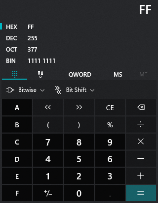
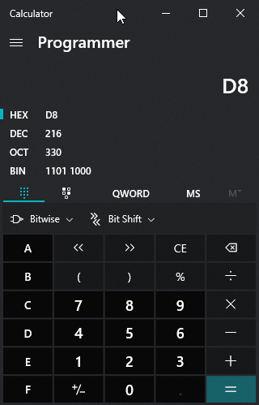

## Crypto challenges

# Ex-ord

## Problem

We are provided with a corrupted image and we need to fix it.

I thought of a number of solutions for this one, from editing magic bytes to using steganography tools to try and extract some information out of it. The correct solution was a bit straightforward since the name was giving us a pretty self-explainatory clue.

## Solution

The image had been XORed. To undo it, we can extract the bytes in hex from the image and find the key to decrypt it. These are 2 different approaches for extracting the hexbytes out of it:

---
1. Extracting bytes
---

### Linux

Use `hexdump` on the image to extract all the bytes.

### Windows

Use [FlexHEX](http://www.flexhex.com/download/) on the image to extract all the bytes.

---

Once we have our hexbytes, we can follow the clue of the extension of the file, it's a `.jpg` and we know the [magic bytes](https://en.wikipedia.org/wiki/List_of_file_signatures) for `.jpg` and `.jpeg` both start with `FF D8 FF`. Once again, I can offer you 2 ways of finding the key:

---
2. Getting key
---

### Maths

If we take the decimal values of `FF` and `D8` we get `255` and `216`, respectively.

If we take the three first hex bytes from the cryptofile we were given, we can observe they are `DA FD DA`. Recognise the pattern? Looks like a ROT13 we seen earlier in other challenges! Well, it's [XOR](https://en.wikipedia.org/wiki/Exclusive_or) this time.
`DA` equals `218` in decimal and `FD` equals `253`

Now that we have the values we want to have and the values we currently have, if we compare each byte we will see a pattern here:

* FF - DA = 255 - 218 = 37 
* FD - D8 = 253 - 216 = 37

37 in hex is 0x25 so there we have our key

### Cyberchef

We can easily brute-force the key with Cyberchef if we are not fancy of doing maths.

Just paste the first 3 hex bytes and look for the pattern of a `.jpg` file. If you read above, surprise surprise we will find `FF D8 FF` at the key 0x25 =)

---

Now that we have the key we just need to apply it to the whole hexdump of the image and render the image back. We can do all of it with Cyberchef, so I'll just paste the solution here:

Go back to [Crypto](./)

