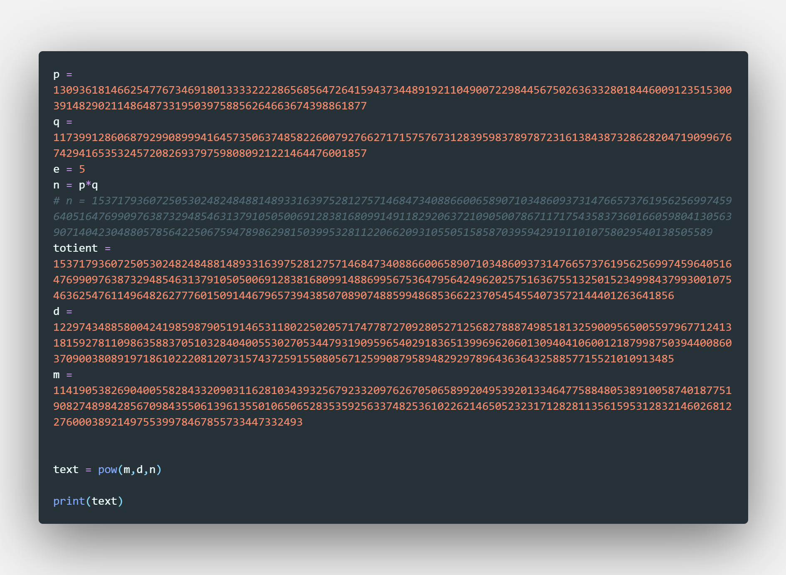
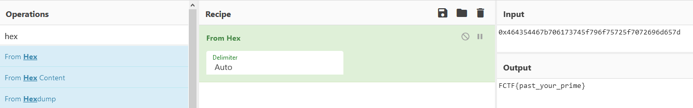

## Crypto challenges

# RSA Warmup

## Problem

We are given some values for a RSA key and an encrypted message. We need to calculate the remaining parts of the key and decrypt the message

## Solution

We have all the numbers we need to calculate the [RSA Key](https://www.cryptool.org/en/cto-highlights/rsa-step-by-step), just follow this [guide] along.

Here's a piece of code you can practice with in python:

And the flag:

