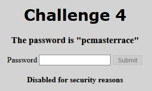
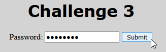
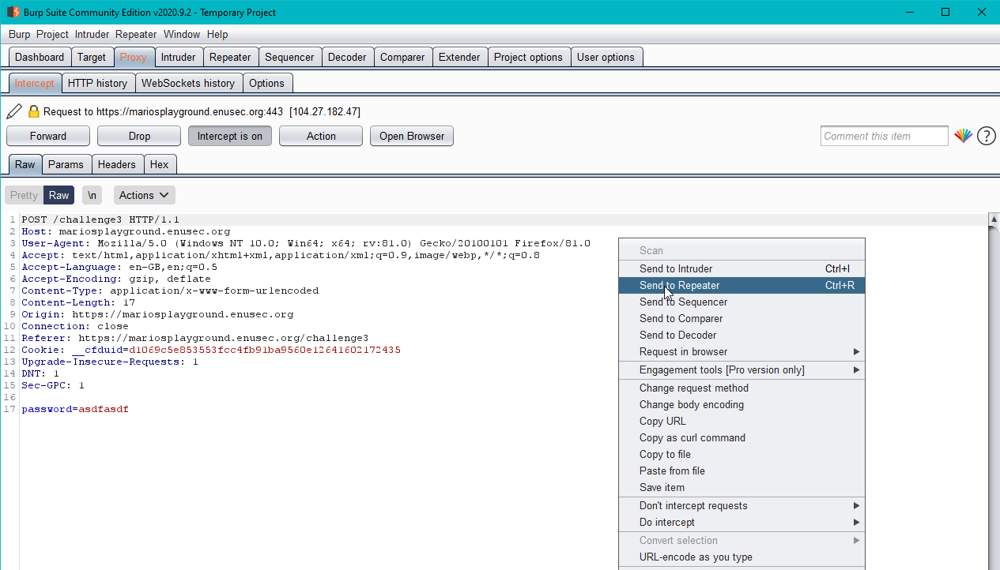
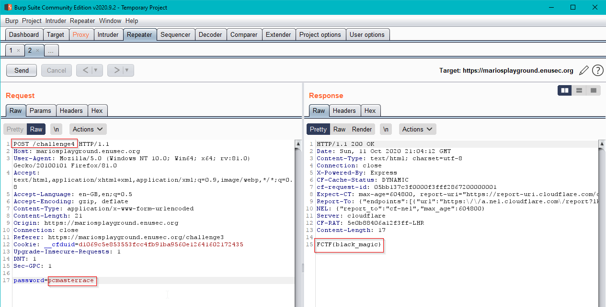

## Mario's WebApp Playground
# Challenge 4

## Problem

Let the fun begin! This time we are provided with the password however, the button to submit it doesn't work!

## Solution

Fortunately, we can always ask for help to our bestie Burp Suite! We know the password so we can intercept the post request from any other of the challenges and tamper with it to forward a request to challenge 4 instead, with the password we were provided with in the first place.

Get back and fill the prompt with the given password in any other challenge and click submit

Intercept the POST request in Burp Suite and change challengeN for challenge4

The response arrives with the flag in it! Go grab it!

[Back to Mario's WebApp Playground challenges](./)
