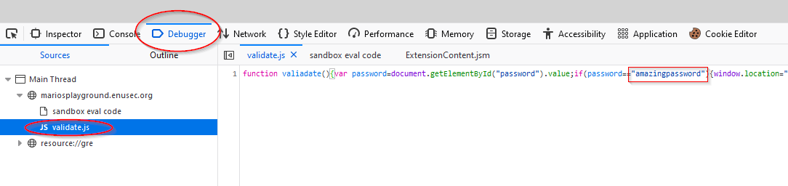

## Mario's WebApp Playground
# Challenge 5

## Problem

They tried to hid the flag again from us, but we are stubborn and we'll keep looking for it no matter what, right?

## Solution

This time it was hidden in the `validate.js` script, we can read it from the Debugger section of the devtools. Now this has been so far a nice tour through all the places something could be forgotten in a variable or a comment by a webdev, isn't it?

[Back to Mario's WebApp Playground challenges](./)
