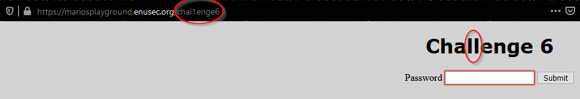
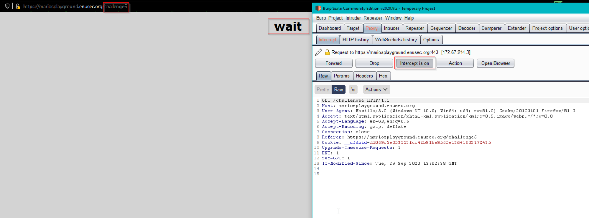
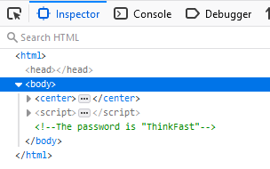

## Mario's WebApp Playground
# Challenge 6

## Problem

For this last one we will need again the help of our loyal friend Burp.

We click the link to challenge six and depending on your specs and connection, you may see a little text saying `Wait`. If you didn't see it you'd probably go ahead and start going over the devtools again and eventually spot the difference: there is something *funny* on the URL.

## Solution

If we try to fix `chal1enge6` to `challenge6` we see we get redirected back to `chal1enge6`, so we need to intercept the request to give us some time to explore the redirection website.

We can then find the password commented out in the same place than the challenge 1 one.

[Back to Mario's WebApp Playground challenges](./)
