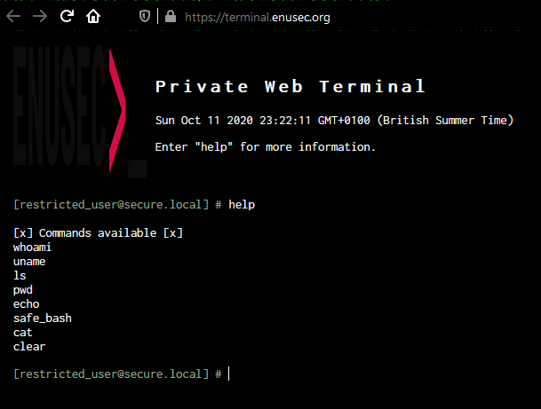
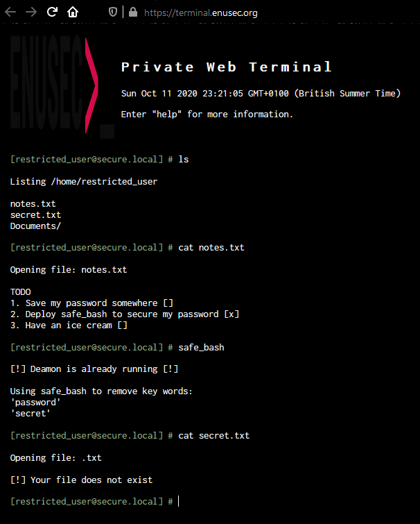
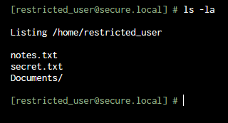
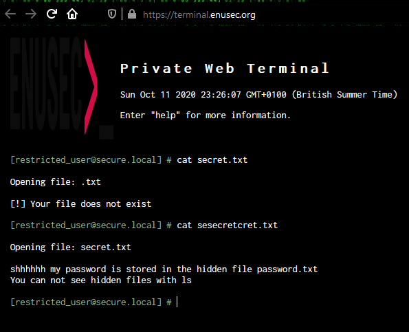
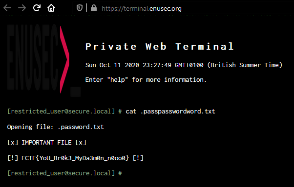

## Misc

# Private Terminal

## Problem

We are presented with a web terminal in which you can run only several commands and has the words "password" and "secret" replaced.

Also, command flags won't work here

## Solution

In order to advance, we will need to get rid of the string replace. It appears to be `string.replace("word", "")` so we can exploit it by wrapping the parsed word, i.e. `cat sesecretcret.txt`:

Great, we have the hint that the file containing the flag is hidden somewhere. We can't use special characters, therefore it must be in our current directory. Wild guessing, we try: `cat .passpasswordword.txt`

