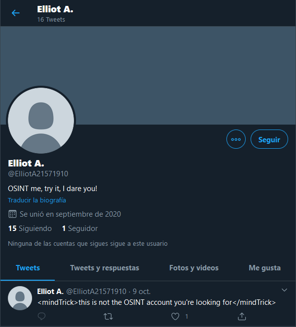
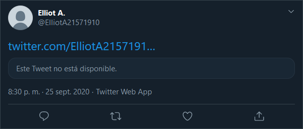
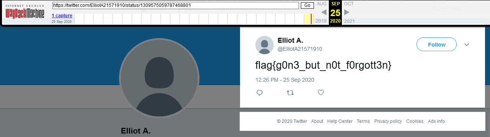

## OSINT

# A long Time Ago

## Problem

```
What is uploaded to the internet...
```

... well, it effectively stays in the internet, and we are going to prove it with this challenge.

## Solution

If we follow the clue of the last challenge and investigate the recently found Twitter of Elliot A. we spot a deleted tweet.




There is a marvelous tool available for us called [The Wayback Machine](https://web.archive.org/) which is an archive of the whole internet that you can consult whenever you want to go back in the past.

We will try and use it to reveal the deleted tweet from Elliot A:




[Go back to OSINT challenges](./)
