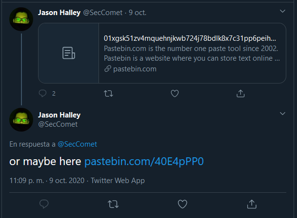

## OSINT

# Libraries

## Problem

```
You have all you need to find me.
```

Let's then investigate about what we already have:

### Dade's twitter hints:


1) Volume? 29? Let's save it for later.


2) This reference to Hackers (the legendary movie (from which the author of the callenge also took "Real life" Zero-cool's name (thank you, SecComet))), made me revisit SecComet's profile since I saw something similar:


So we have wall 2 and shelf 5


### Elliot's Twitter:


Remember the video from earlier? There was another hint on it! Page 189

### SecComet's Twitter:




There was a tweet about a pastebin but got erased, so checked in his github and there it was.


# Solution

### Putting everything together

So far we have:

1) Wall 2
2) Shelf 5
3) Volume 29
4) Page 189
5) A long hex string
6) No clue on what to do with all this.


Fortunately the author released a hint that said `"Library of Babel"`, referencing the universe of the book from Jorge Luis Borges, where the whole world is a gigantic library made out of hexagons, 2 walls are for connecting with other hexagons and the other 4 are divided in 5 shelves, with 32 volumes in each shelf, where all the knowledge of the world exists in books made out of 25 characters. Apparently that universe exists today on the internet on the page `https://libraryofbabel.info`, amazing! Now we can use all the info we previously gathered and get our flag:


This was by far the challenge I enjoyed the most. It wasn't only the challenge I spent more time on, I wasn't even able to finish it by the time the CTF finished due to I was looking wrongly to the website, using `Search` instead of `Browse`. Very nice one [SecComet](https://github.com/SecComet)

[Go back to OSINT challenges](./)
