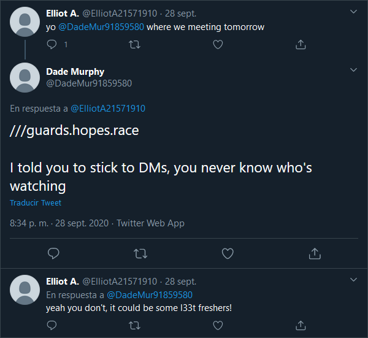

## OSINT

# OpSec Fail

## Problem

If we keep scrolling through Elliot A's Twitter account we spot somebody interacted with him asking where to meet. And he replied. Whoops. 

## Solution

Immediately after I saw the 3 `///` and that sequence of 3 random words separated by dots I remembered a very useful emergency app I downloaded 1 year ago and forgot about it. 

[What 3 words](https://what3words.com) is a solution in case you get lost in a trip or want to accurately give an address. The devs divided the whole world in squares of 3 by 3 meters, naming every each one of them after 3 random unique words that never change.

The only thing we need to do is going to their website and searching those 3 words we found. The [] marks the location of the treasure.

`FCTF{Demo's Wonder Wheel Amusement Park}`

[Go back to OSINT challenges](./)
