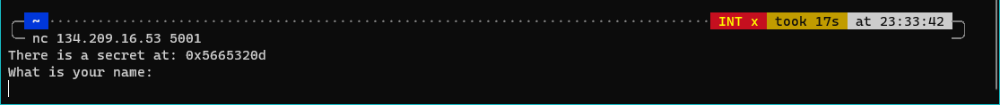
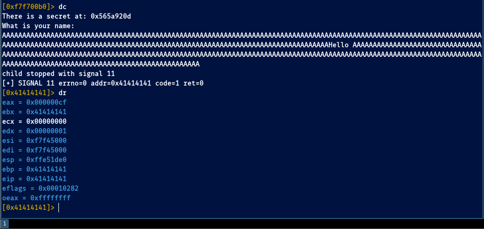
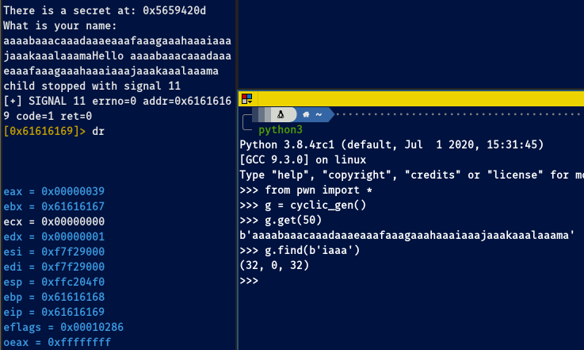
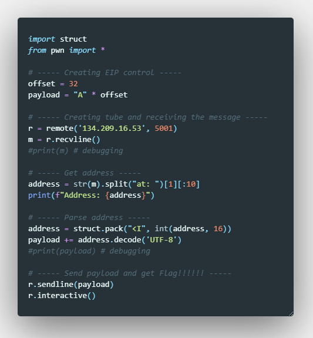
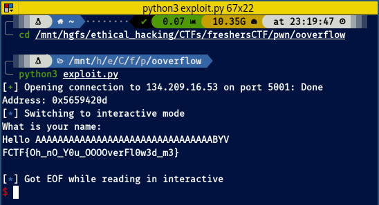

## Pwn challenges

# Ooverflow

## Problem

Although the name gives a really nice hint, it was no easy task at all for me getting this one.

We are told the address in memory of the secret flag. If we try to connect several times we see the address changes every time, which means ASLR (Address Space Layout Randomization) mode is activated, so vaguely speaking every time the program is called it will generate different adress spaces. 
With all this information, in order to get our flag popping up in our shell, we will need:
1. To calculate the offset where we can overwrite the EIP to point towards the address in which the secret is waiting for us 
2. To write an exploit to get the address and parse it into our payload. 

We are provided with the binary, let's take a look at its guts then!!

# Solution

First thing we must do is finding the offset.

We see it's indeed possible and therefore we must find the exact point at where we can overflow the stack and overwrite to the pointer. For that, we can use a cyclic pattern using `pwntools`:

With `pwn.cyclic_gen().get()` we can create a [De Brujin sequence](https://en.wikipedia.org/wiki/De_Bruijn_sequence) to easily find the offset. If we copy/paste the pattern into the running program and check where is the EIP pointing at, we can get back to the python terminal and put the address into a find method to discover how long is the offset. For this instance, see the image below: 

We see the register is pointing at `0x61616169`. Bear in mind 32-bit ELF binaries are little endian, this means we need to flip it back in python to find the right offset. Checking with the ascii table, `61` is `a` and `69` is `i`, so if we are seeing `61 61 61 69` in the pointer we need to flip it back to `69 61 61 61` because of the endianness. Then it's a piece of cake going back to our python terminal and issue `cyclic_gen().find(b'iaaa')`. We find then our offset is at 32 bytes exactly from the beginning. 

Good news! We can go on with creating our exploit script!!!
 
For it I will be using `python3` and the modules `struct` and `pwntools`

I've created it with comments that I think are self-explanatory if you have been following the write-up, so here you go!

Go back to [Pwn](./)
