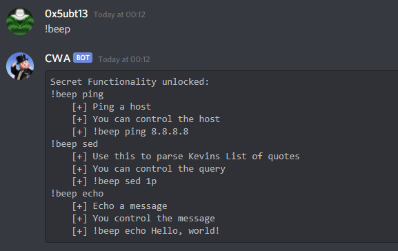
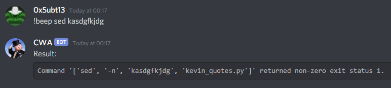

## Pwn challenges

# Kevin Mitnick

## Problem

The bot at discord has a flag. Let's get it!

## Solution

After fizzling around with the bot, we find that we can issue the command `!beep` for unlocking extra functionalities. We can use the `sed` command so let's see what's this bot made of!

If we issue a wrong command, it will tell us itself what's the command it attempted, so we know now that we can't use any special characters, and it's reading a .py script with quotes on it. We need to get around it and explore the folder the bot is in.

Go back to [Pwn](./)
