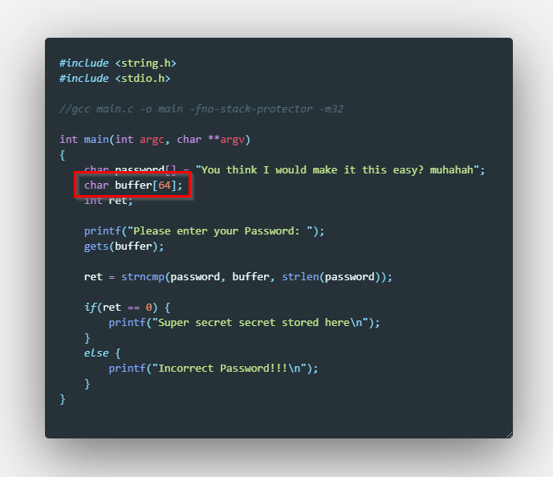
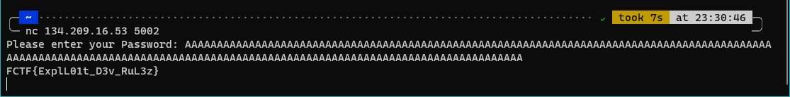

## Pwn challenges

# Take it Back

## Problem

For this challenge we only really need to get back to basics, as the name well suggests. 

If we take a look at the code we are provided with, we can observe it's allocating a buffer for 64 characters.

# Solution

Just throw a good bunch of your favourite letters to it or headbang the keyboard for a while (64 or more) and the buffer will [overflow](https://en.wikipedia.org/wiki/Buffer_overflow) spitting out the flag.

Go back to [Pwn](./)
