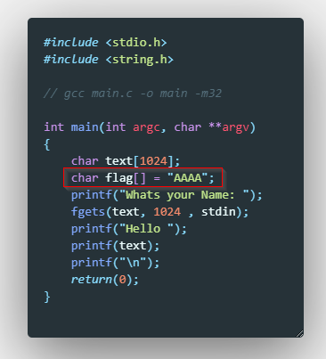
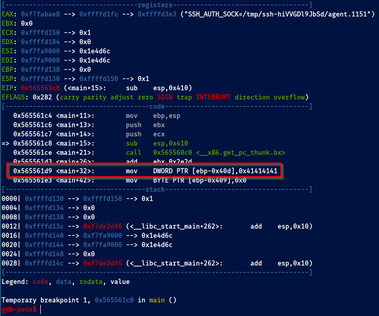
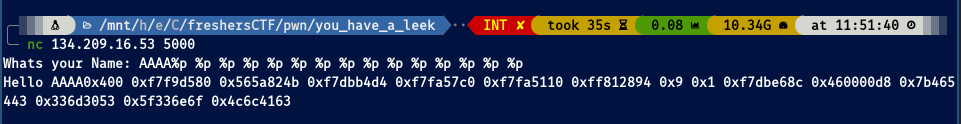
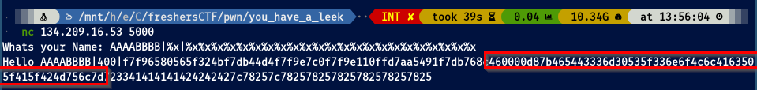
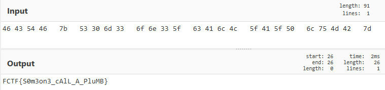

## Pwn challenges

# You Have a "Leek"

## Problem:

I've particularly enjoyed this one. I didn't know anything about format string vulnerabilities before so the research I had to do was exhausting, but very rewarding!

## Solution:

From the code we know the flag is stored somewhere in the stack when the main function is called. Let's compile and debug it!

If we run the program we can confirm it's right there, staring at us.

After trying to exploit it by several ways, I got hinted on format string vuln and tried it 

It works! It's leaking info about the addresses of the stack! We need now to read the contents of the stack, so we use `%x` to get the stack in hex values to avoid bad decoded symbols:

Now that we have the hex bytes, we need to rearrange them since the binary is a 32-bit executable so its architecture is little endian. We need to swap over the bytes and we have our flag!

Go back to [Pwn](./)
