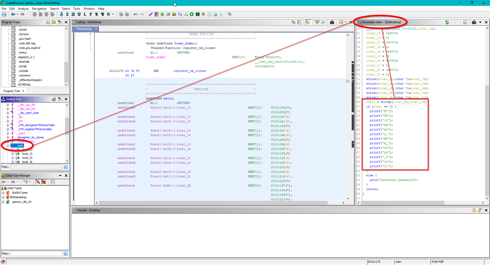

## Rev challenges

# Ghidra Ninja

## Problem

We get a binary and are told Ghidra would be handy for this situation.

# Solution

We only need to boot Ghidra and go to the strcmp instruction in the main function. There's our flag, waiting for us to grab it :)

Go back to [Rev](./)
