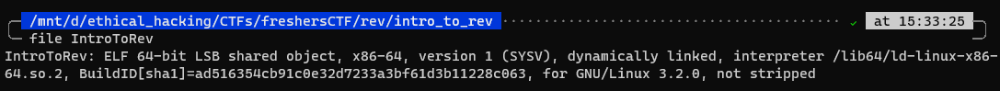
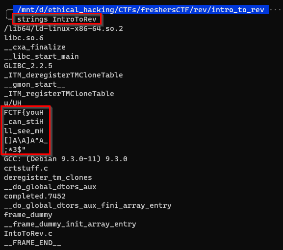

## Rev

# Intro to Rev(erse engineering)

## Problem

A file! Let's download it!

If we go and type into a terminal `file IntroToRev`, we see the creator gave us an executable. Let's crack it open!

## Solution

There are 2 possible easy solutions for this challenge I can think of.

### Solution 1: `strings`

`strings` will extract all the text strings out of the executable. We just need to call it issuing `strings IntroToRev` in a terminal and we get our flag

### Solution 2: `Disassemble`

Open the file in a disassembler like IDA and check the hex!!

 
