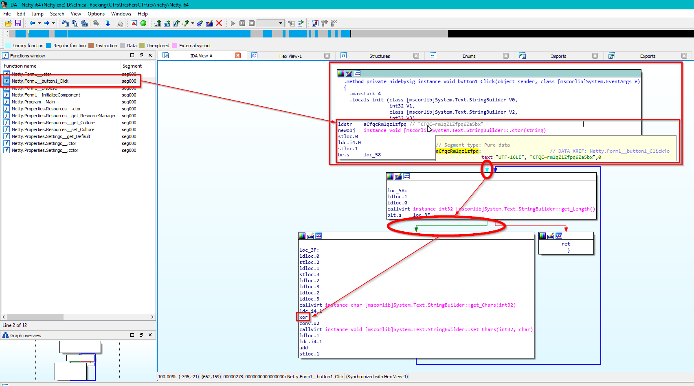

## Rev challenges

# Netty

I was really honoured of being the only participant able to solve this challenge! Here's how I did it:

## Problem

We are provided with a .exe with a cute dog and a button. The button doesn't make you get the flag and it gets as dry as it sounds. Let's dive deep into the machine code to discover more about that suspicious button!

# Solution

From the instructions we can observe what looks like an obfuscated flag laying around the button function. If we follow the path, we see a XOR operation below. What if we try to brute-force XOR that string?

Go back to [Rev](./)
 
