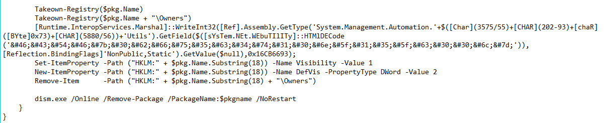
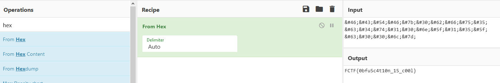

## Rev challenges

# Obfshell

## Problem

We get a .ps1 script which doesn't apparently do anything.

## Solution

Looking into the obfuscated code, once we arrange it, we detect a suspicious encoded string of text.

It looked like hex to me, so I went ahead and tried to decode it.

Go back to [Rev](./)
