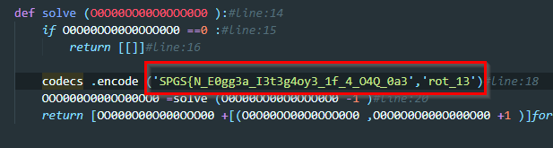

## Rev challenges

# Obfy

## Problem

We get an obfuscated python script. Our job will be deobfuscating it

## Solution

In line 18 we find the flag encrypted using [ROT13](https://en.wikipedia.org/wiki/ROT13)
We only need to decrypt it

`FCTF{A_R0tt3n_V3g3t4l3_1s_4_B4D_0n3}

Go back to [Rev](./)

