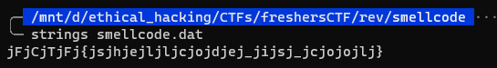

## Rev challenges

# Smellcode

## Problem

Another executable!

## Solution

Very similarly to Intro to Rev, we can use `strings` with this one as well and the flag will just pop up.

We only need to scrap all those "j" and get our flag

`FCTF{shellcode_is_cool}`

Go back to [Rev](./)
