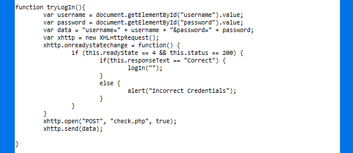
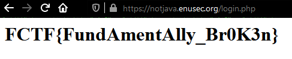

# Not Java

## Problem

```
Ooops.

Looks like the developers of this Authentication system left a huge gigantic gaping hole in the application.

Can you exploit their incompetence?
```

We are presented a dull login page. 

Exactly as it happened to me with [Saucy](./saucy.md), happened to me with "Not Java". 

I realised the solution at the time the CTF was about to finish. I guess some pressure helps me thinking!

# Solution


If we stop trying to bruteforce the login form for a minute and check the script running in the page, we find it's calling a function to log us in. That function is checking parameters and then calling another function: `logIn("")`. The only thing we need to do is calling it in the devtools console and we'll get the door wide open!.




We get redirected to our flag straight away:



[Go back to Web challenges](./)
