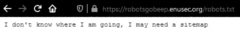
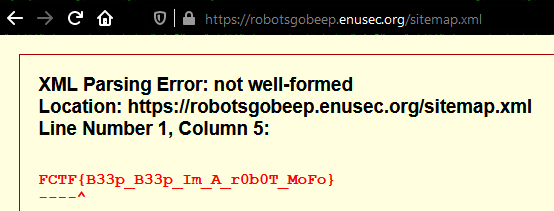

# Robots go Beep	

## Problem

We are given a website with a big robot in it and nothing else. Well, the hint is pretty obvious, isn't it?

# Solution

We only need to check /robots.txt to follow the clue.

Another hint, this time about the sitemap! We know what to do, don't we?

[Go back to Web challenges](./)
