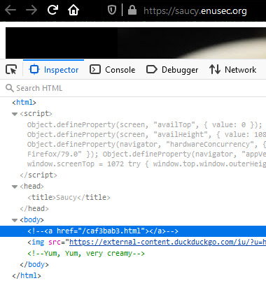
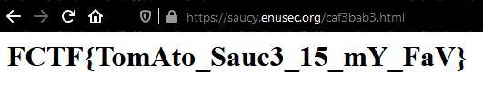

# Saucy

## Problem

We are given a website containing a yummy tomato sauce picture. I personally went mad overcomplicating this one trying to steganography the hell out of the picture without any result.

# Solution

Then I realised `saucy` was a hint towards `source` (code), so I double-checked and there it was:

That easy, just go to that folder. Note to future-self: try and get the low hanging fruit first, you *dummy*!

[Go back to Web challenges](./)
